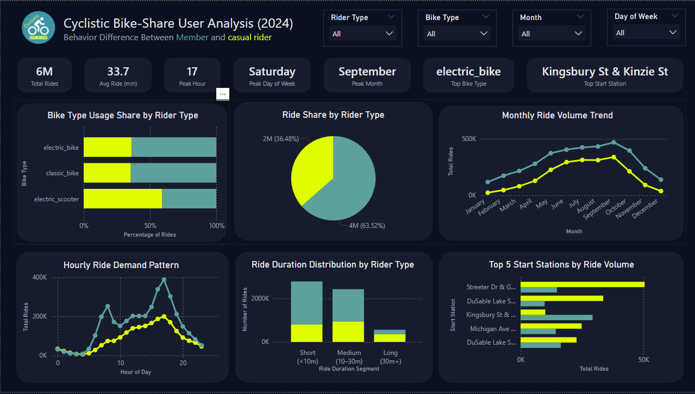
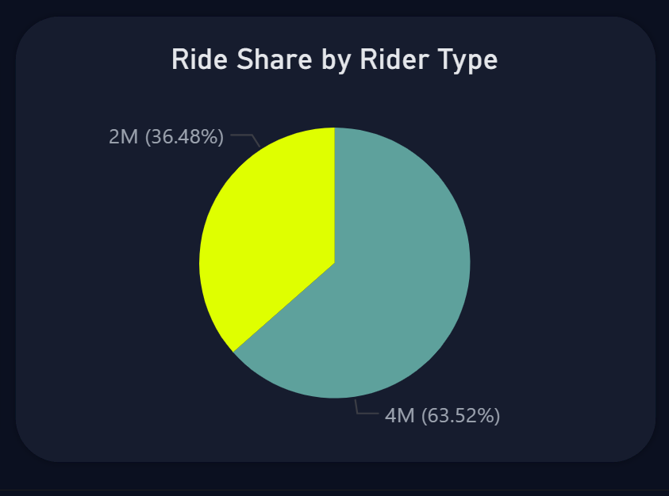
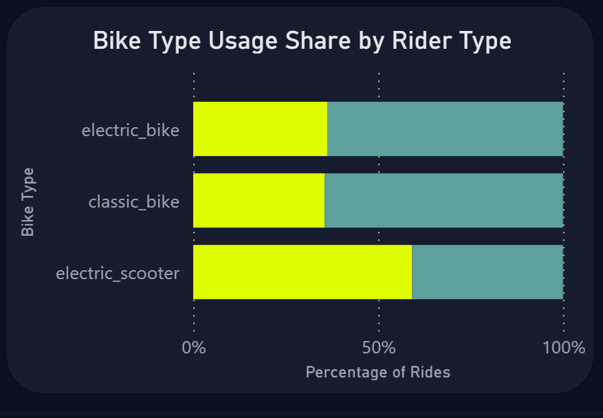
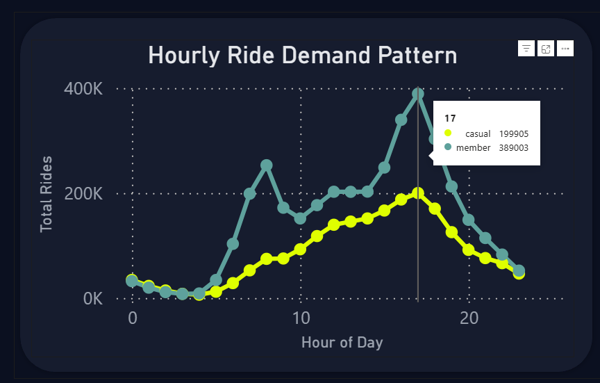
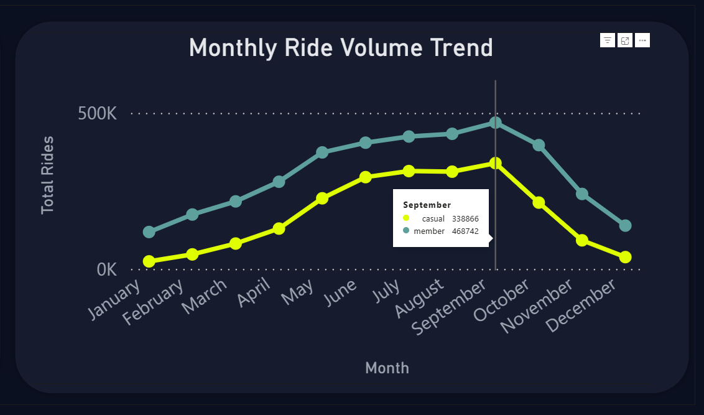
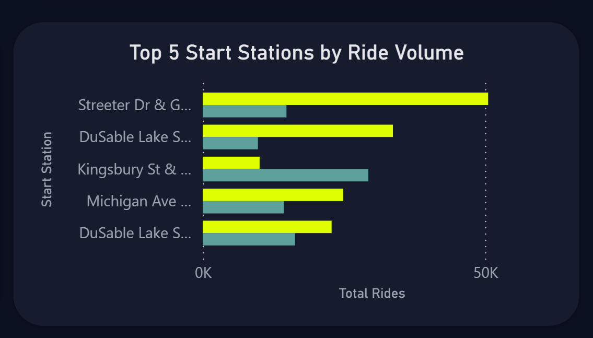

# 🚲 Cyclistic Bike-Share User Analysis (2024)

## Project Overview
This project analyzes bike-share usage data to understand how **casual riders** and **annual members** use Cyclistic bikes differently.  
The goal is to translate these behavioral differences into **actionable insights** that could help increase **membership conversion**.

The project follows an end-to-end analytics workflow using **Excel Power Query, SQL Server, and Power BI**, similar to real-world analytics pipelines.

---

## Business Question
**How do annual members and casual riders use Cyclistic bikes differently, and how can these insights be used to convert casual riders into members?**

---

## Tools Used
- **Excel Power Query** – initial data cleaning and standardization  
- **SQL Server** – data staging, validation, transformation, and analytics views  
- **Power BI** – interactive dashboard and visual storytelling  
- **GitHub** – version control and documentation  

---

## Dataset
- Source: Cyclistic Bike-Share dataset  
- Format: 12 monthly CSV files  
- Time period: January 2024 – December 2024  

---

## Project Workflow

### 1. Excel Power Query – Initial Cleaning
- Removed duplicate records  
- Trimmed and standardized text fields  
- Standardized datetime formats  
- Ensured consistent column names across all files  

Cleaned files were exported as CSVs for database loading.

---

### 2. SQL Server – Staging and Validation
- Created a staging table with all columns stored as text  
- Bulk imported all 12 monthly CSV files  
- Used this layer only for ingestion and validation  

---

### 3. SQL Server – Cleaning & Feature Engineering
- Converted data types using `TRY_CONVERT`  
- Calculated ride duration in minutes  
- Created analytical columns:
  - Ride month  
  - Day of week and day name  
  - Hour of day  
  - Weekend indicator  
- Removed invalid rides (negative duration or rides longer than 24 hours)  

---

### 4. SQL Views – Analytics Layer
Created SQL views to act as a semantic layer for Power BI:
- Dimension views for slicers  
- KPI summary view  
- Analysis views for trends, time patterns, bike types, and stations  

---

### 5. Power BI Dashboard
Power BI connects directly to SQL views and presents:
- Executive KPIs  
- Rider-type comparison  
- Time-based usage patterns  
- Ride duration distribution  
- Bike type preferences  
- Top start stations  

---

## Key KPIs
- Total rides  
- Average ride duration  
- Peak hour  
- Peak day of week  
- Peak month  
- Most used bike type  
- Most popular start station  

---

## Insights & Visual Analysis

### 1️⃣ Overall Dashboard – Big Picture

**Insight:**  
The system recorded **6M total rides** with an average ride duration of **33.7 minutes**.  
The overall peak occurs at **5 PM**, on **Saturday**, with **September** being the busiest month.  
This highlights strong seasonality and a mix of commute and leisure usage.

---

### 2️⃣ Total Rides by Rider Type

**Insight:**  
Annual members account for the majority of total rides, showing **high-frequency usage**.  
Casual riders contribute fewer trips overall but still represent a meaningful share, making them a strong conversion opportunity.

---

### 3️⃣ Bike Type Preference by Rider Type

**Insight:**  
**Electric Scooters are mainly preferred by casual riders**, suggesting comfort and ease are key factors for leisure usage.  
Members show more balanced bike usage, aligning with routine, functional travel.

---

### 4️⃣ Ride Duration Distribution

**Insight:**  
Long rides (30+ minutes) are dominated by **casual riders**, while **short and medium rides** are mostly taken by members.  
This confirms leisure-oriented usage versus routine commuting behavior.

---

### 5️⃣ Hourly Ride Demand Pattern

**Insight:**  
Members show clear commute peaks at **8 AM and 5 PM**.  
Casual riders peak mainly around **5 PM**, with no strong morning spike.

---

### 6️⃣ Monthly Ride Volume Trend

**Insight:**  
Ride volume increases steadily from **March**, peaks in **September**, and drops sharply after **October**.  
Casual rider activity is especially seasonal, indicating summer as the best conversion window.

---

### 7️⃣ Top Start Stations by Rider Type

**Insight:**  
Casual riders most often start trips at **Streeter Dr & Grand Ave**, a leisure-focused location.  
Members most frequently start at **Kingsbury St & Kinzie St**, indicating commute-based usage.  
This shows that different rider types use different parts of the city.

---

## Business Recommendations
- Offer **weekend-focused or seasonal membership plans**  
- Use **electric-bike incentives** to attract casual riders  
- Run promotions at **high-traffic casual rider stations**  
- Highlight cost savings for frequent leisure riders  

---

## Final Takeaway
Casual riders are **leisure-driven users with clear and predictable patterns**.  
By aligning memberships with **when**, **where**, and **how** they ride, Cyclistic can convert casual riders into long-term members.
